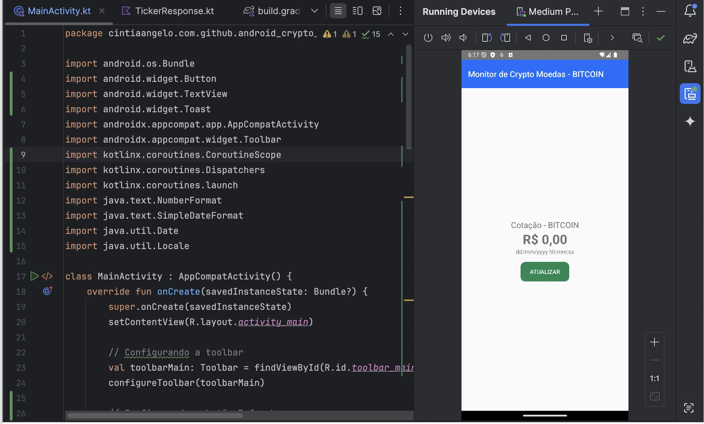
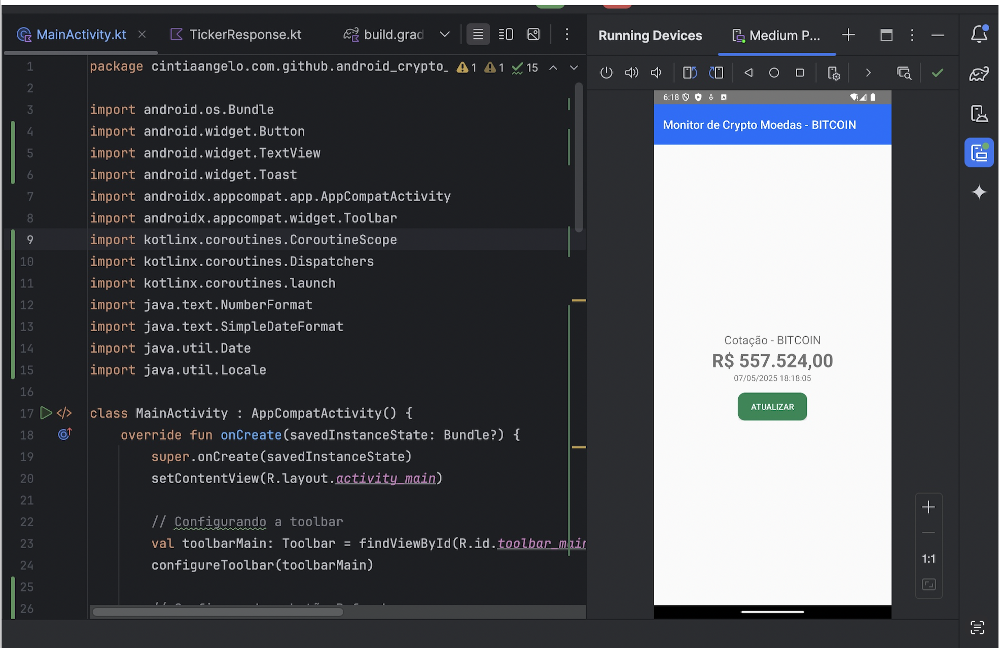

# 📱 Android Crypto Monitor

## 🧾 Sobre o Projeto

O **Android Crypto Monitor** é um aplicativo Android desenvolvido em **Kotlin** que exibe a **cotação atual do Bitcoin em tempo real**. Utilizando a **API do Mercado Bitcoin**, o app busca e apresenta informações atualizadas sobre o valor do BTC, permitindo que os usuários acompanhem as flutuações do mercado diretamente em seus dispositivos móveis.

---

## 🚀 Tecnologias Utilizadas

- **Kotlin**: Linguagem principal para o desenvolvimento do aplicativo.
- **Retrofit**: Biblioteca para requisições HTTP e consumo de APIs REST.
- **Gson**: Conversor JSON para objetos Kotlin.
- **Android SDK**: Ferramentas e bibliotecas para desenvolvimento Android.
- **Gradle**: Sistema de automação de compilação e gerenciamento de dependências.

---

## ⚙️ Pré-requisitos

- Android Studio instalado.
- SDK do Android configurado.
- Acesso à internet para consumo da API do Mercado Bitcoin.

---

## 📦 Instalação

1. Clone o repositório:

```bash
git clone https://github.com/CintiaAngelo/android-crypto-monitor.git
```

2. Abra o projeto no Android Studio.

3. Sincronize o projeto com o Gradle.

4. Conecte um dispositivo Android ou inicie um emulador.

5. Compile e execute o aplicativo.

---

## 🧩 Estrutura do Projeto

```
📁 app/src/main/java/cintiaangelo/com/github/android_crypto_monitor/
├── MainActivity.kt
├── MercadoBitcoinService.kt
└── MercadoBitcoinServiceFactory.kt

📁 app/src/main/res/layout/
├── activity_main.xml
├── component_quote_information.xml
└── component_toolbar_main.xml

📁 app/src/main/res/values/
└── strings.xml
```

**Descrição dos arquivos:**

- `MainActivity.kt`: Gerencia a UI e faz a chamada à API.
- `MercadoBitcoinService.kt`: Define os endpoints da API.
- `MercadoBitcoinServiceFactory.kt`: Cria e configura o Retrofit.
- `activity_main.xml`: Layout principal da aplicação.
- `component_quote_information.xml`: Componente que exibe as informações da cotação.
- `component_toolbar_main.xml`: Layout personalizado da toolbar.
- `strings.xml`: Recursos de strings usadas no app.

---

## 🧠 Funcionamento do Código

### 🔸 MainActivity.kt

A `MainActivity` é responsável por inicializar a interface, configurar a toolbar e lidar com a atualização da cotação.

```kotlin
override fun onCreate(savedInstanceState: Bundle?) {
    super.onCreate(savedInstanceState)
    setContentView(R.layout.activity_main)

    val toolbarMain: Toolbar = findViewById(R.id.toolbar_main)
    configureToolbar(toolbarMain)

    val btnRefresh: Button = findViewById(R.id.btn_refresh)
    btnRefresh.setOnClickListener {
        makeRestCall()
    }
}
```

### 🔸 makeRestCall()

Esse método utiliza **coroutines** para buscar os dados da API sem travar a interface:

```kotlin
private fun makeRestCall() {
    CoroutineScope(Dispatchers.Main).launch {
        try {
            val service = MercadoBitcoinServiceFactory().create()
            val response = service.getTicker()

            if (response.isSuccessful) {
                val tickerResponse = response.body()

                val lblValue: TextView = findViewById(R.id.lbl_value)
                val lblDate: TextView = findViewById(R.id.lbl_date)

                val lastValue = tickerResponse?.ticker?.last?.toDoubleOrNull()
                if (lastValue != null) {
                    val numberFormat = NumberFormat.getCurrencyInstance(Locale("pt", "BR"))
                    lblValue.text = numberFormat.format(lastValue)
                }

                val date = tickerResponse?.ticker?.date?.let { Date(it * 1000L) }
                val sdf = SimpleDateFormat("dd/MM/yyyy HH:mm:ss", Locale.getDefault())
                lblDate.text = sdf.format(date)

            } else {
                val errorMessage = when (response.code()) {
                    400 -> "Bad Request"
                    401 -> "Unauthorized"
                    403 -> "Forbidden"
                    404 -> "Not Found"
                    else -> "Unknown error"
                }
                Toast.makeText(this@MainActivity, errorMessage, Toast.LENGTH_LONG).show()
            }

        } catch (e: Exception) {
            Toast.makeText(this@MainActivity, "Falha na chamada: ${e.message}", Toast.LENGTH_LONG).show()
        }
    }
}
```

---

## 🧾 Exemplo de resposta da API

```json
{
  "ticker": {
    "last": "345000.00",
    "date": 1715108620
  }
}
```

Esses dados são convertidos e exibidos para o usuário com formatação em reais e data legível.

---

### 🔸 MercadoBitcoinService.kt

Define o endpoint da API do Mercado Bitcoin:

```kotlin
interface MercadoBitcoinService {
    @GET("api/BTC/ticker/")
    suspend fun getTicker(): Response<TickerResponse>
}
```

---

### 🔸 MercadoBitcoinServiceFactory.kt

Cria uma instância configurada do Retrofit para fazer as chamadas:

```kotlin
object MercadoBitcoinServiceFactory {
    fun create(): MercadoBitcoinService {
        val retrofit = Retrofit.Builder()
            .baseUrl("https://www.mercadobitcoin.net/")
            .addConverterFactory(GsonConverterFactory.create())
            .build()
        return retrofit.create(MercadoBitcoinService::class.java)
    }
}
```

---

## 🖼️ Demonstração

### 📉 Antes de Atualizar a Cotação
Ao iniciar o aplicativo, antes da chamada da API ser feita, os campos de valor e data da cotação ainda estão vazios ou com valores padrão. Isso ocorre porque a função makeRestCall() só é chamada ao clicar no botão "Atualizar".



### 📈 Após Atualizar a Cotação
Ao clicar no botão de atualização (btn_refresh), a função makeRestCall() é executada. A partir disso, a API responde com a cotação e a data, que são formatadas e exibidas na interface:

